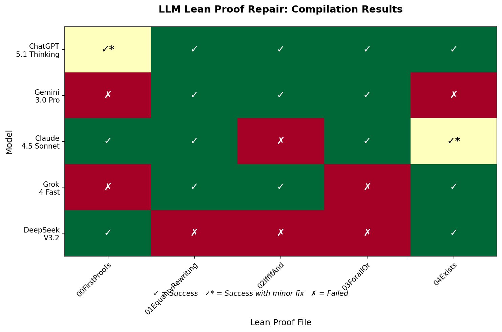
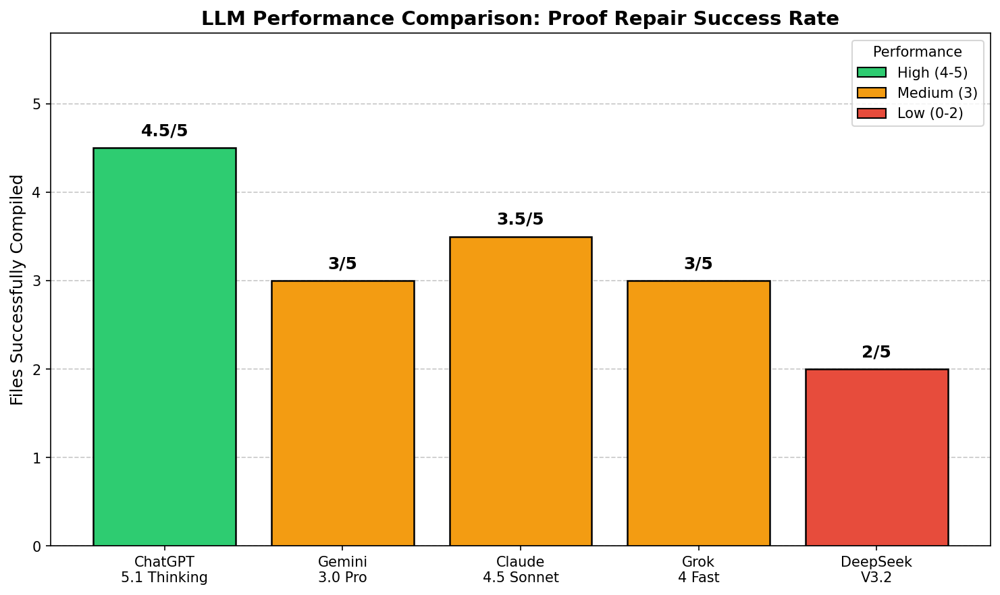

# LLM Lean Proof Repair Experiment

An empirical study evaluating how well Large Language Models can diagnose and repair buggy Lean 4 proofs.

## Overview

This project investigates the capability of state-of-the-art LLMs to:
1. **Identify** errors in intentionally broken Lean proofs
2. **Explain** the underlying mathematical or structural issues
3. **Repair** the proofs to compile successfully

I tested **5 LLMs** across the **first 5 Lean proof files** from the [Lean Community Tutorials](https://github.com/leanprover-community/tutorials4), each containing multiple intentionally introduced bugs.

## Methodology

### Bug Introduction
I manually introduced bugs into working Lean proofs from the tutorials repository. Bug types include:
- **Wrong variable references** (e.g., using `y_in` instead of `x_in`)
- **Incorrect arithmetic expressions** (e.g., `(x - y) / 2` instead of `(y - x) / 2`)
- **Missing hypothesis introductions**
- **Wrong tactic selection** (e.g., `linarith` for multiplicative goals)
- **Reversed rewrite directions**
- **Swapped function arguments**

### Prompt Design
Each LLM received:
1. The buggy Lean file
2. The exact compiler error messages
3. Instructions to: infer the problem, explain the issue, and rewrite to compile

### Evaluation Criteria
- **Compilation success**: Does the repaired file compile without errors?
- **Error identification accuracy**: Did the LLM correctly diagnose the bugs?

## Models Tested

| Model | Version/Variant |
|-------|-----------------|
| ChatGPT | 5.1 Thinking (Extended) |
| Gemini | 3.0 Pro |
| Claude | 4.5 Sonnet |
| Grok | 4 Fast |
| DeepSeek | V3.2 DeepThink |


## Results

### Compilation Success Rate



| File | ChatGPT | Gemini | Claude | Grok | DeepSeek |
|------|:-------:|:------:|:------:|:----:|:--------:|
| 00FirstProofs | ✓* | ✗ | ✓ | ✗ | ✓ |
| 01EqualityRewriting | ✓ | ✓ | ✓ | ✓ | ✗ |
| 02IffIfAnd | ✓ | ✓ | ✗ | ✓ | ✗ |
| 03ForallOr | ✓ | ✓ | ✓ | ✗ | ✗ |
| 04Exists | ✓ | ✗ | ✓* | ✓ | ✓ |
| **Total** | **5/5** | **3/5** | **4/5** | **3/5** | **2/5** |

*✓ = Compiled successfully, ✗ = Failed to compile, \* = Minor syntax fix needed*

### Performance Analysis



**Key Findings:**

1. **ChatGPT 5.1 Thinking (Extended)** achieved the highest success rate (4.5/5), demonstrating strong capability in formal proof repair with its extended thinking mode.

2. **Error Identification vs. Repair**: Models often correctly identified bugs but failed to produce compiling solutions. For example, Gemini correctly diagnosed issues but had syntax problems in 2/5 files, ChatGPT and Claude also had minor syntax or typo issues on 1 file each, suggesting models are not quite familiarized with the structure of Lean, making it a potentially interesting area to evaluate raw capabilities and intelligence of LLMs.

3. **Explanation Quality Varied**: 
   - Grok consistently failed to provide any explanations despite explicit instructions
   - DeepSeek avoided specific mentions of the bugs and tried to provide overly general and short explanations
   - ChatGPT, Claude, and Gemini provided more targeted diagnostics, with ChatGPT 5.1 also the strongest model to execute.

4. **Some Failure Modes**:
   - Syntax errors in Lean 4 (especially with `calc` blocks and indentation)
   - Over-reliance on automation tactics that don't exist or work differently
   - Misunderstanding of tactic argument patterns
   - Introducing unneeded imports or tactics

## Repository Structure

```
├── data/
│   └── buggy/              # Buggy Lean files used in experiments
├── docs/
│   └── detailed_analysis.md  # Full analysis with per-bug breakdowns
├── results/
│   ├── summary.md          # Condensed findings
│   └── figures/            # Generated visualizations
└── scripts/
    └── generate_charts.py  # Visualization generation script
```

## Source Materials

### Original Lean Files
From [leanprover-community/tutorials4](https://github.com/leanprover-community/tutorials4/tree/master/Tutorials/Solutions):
- [00FirstProofs.lean](https://github.com/leanprover-community/tutorials4/blob/master/Tutorials/Solutions/00FirstProofs.lean)
- [01EqualityRewriting.lean](https://github.com/leanprover-community/tutorials4/blob/master/Tutorials/Solutions/01EqualityRewriting.lean)
- [02IffIfAnd.lean](https://github.com/leanprover-community/tutorials4/blob/master/Tutorials/Solutions/02IffIfAnd.lean)
- [03ForallOr.lean](https://github.com/leanprover-community/tutorials4/blob/master/Tutorials/Solutions/03ForallOr.lean)
- [04Exists.lean](https://github.com/leanprover-community/tutorials4/blob/master/Tutorials/Solutions/04Exists.lean)

### LLM Conversation Links
<details>
<summary>ChatGPT 5.1 Thinking (Extended)</summary>

- [00FirstProofs](https://chatgpt.com/share/691b4045-7c18-8012-bd96-b6edc882c239)
- [01EqualityRewriting](https://chatgpt.com/share/691b4069-534c-8012-a32d-d64cd0af4250)
- [02IffIfAnd](https://chatgpt.com/share/691b4080-aac8-8012-9c55-e3470c3c2bc8)
- [03ForallOr](https://chatgpt.com/share/691b4117-a84c-8012-a23d-ae8fa47f630b)
- [04Exists](https://chatgpt.com/share/691b4177-b654-8012-8c63-7ca3e011b6c7)
</details>

<details>
<summary>Gemini 3.0 Pro</summary>

- [00FirstProofs](https://gemini.google.com/share/56f4c032ed30)
- [01EqualityRewriting](https://gemini.google.com/share/0c18bb2fbfdf)
- [02IffIfAnd](https://gemini.google.com/share/9618a1d4218b)
- [03ForallOr](https://gemini.google.com/share/5cd4cf7eed33)
- [04Exists](https://gemini.google.com/share/67fd6adbbca0)
</details>

<details>
<summary>Claude 4.5 Sonnet</summary>

- [00FirstProofs](https://claude.ai/share/ce349d22-4115-418c-a5df-8af783535a8b)
- [01EqualityRewriting](https://claude.ai/share/1549adc0-b4d6-4c3e-a1b0-e871975cde24)
- [02IffIfAnd](https://claude.ai/share/228fdd58-4f68-429e-810d-e66c64aa53f3)
- [03ForallOr](https://claude.ai/share/cb47e143-7a11-41af-9181-d3c6cf7c84b3)
- [04Exists](https://claude.ai/share/a2a910a0-1919-4a31-8766-6018a810f702)
</details>

<details>
<summary>Grok 4 Fast</summary>

- [00FirstProofs](https://grok.com/share/bGVnYWN5LWNvcHk_d5eb7013-fe70-4a19-bc60-7cb1f8e692ca)
- [01EqualityRewriting](https://grok.com/share/bGVnYWN5LWNvcHk_c006fd57-17f4-4785-8a2d-dc1c2e1efb28)
- [02IffIfAnd](https://grok.com/share/bGVnYWN5LWNvcHk_e6304c65-b41a-42f0-8629-0819b5103f49)
- [03ForallOr](https://grok.com/share/bGVnYWN5LWNvcHk_80c59f0e-68fd-4a0e-8d2c-861e28757f1c)
- [04Exists](https://grok.com/share/bGVnYWN5LWNvcHk_d574bf7e-6233-486e-ad6f-c9bada3a7566)
</details>

<details>
<summary>DeepSeek V3.2 DeepThink</summary>

- [00FirstProofs](https://chat.deepseek.com/share/2pa1e8a87fvsjsl4wq)
- [01EqualityRewriting](https://chat.deepseek.com/share/i2infardsa1er7r2b5)
- [02IffIfAnd](https://chat.deepseek.com/share/i2infardsa1er7r2b5)
- [03ForallOr](https://chat.deepseek.com/share/5i04h1yz08ntj874s8)
- [04Exists](https://chat.deepseek.com/share/xbzcdfgmzl3y720mfx)
</details>

## License

MIT
